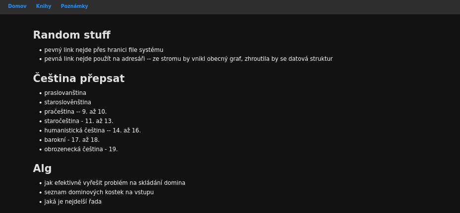
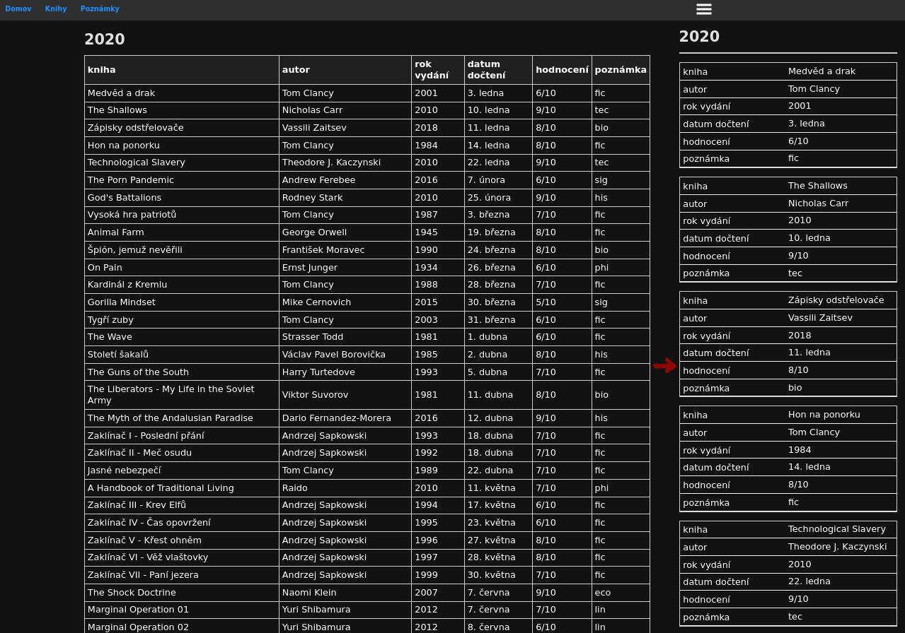
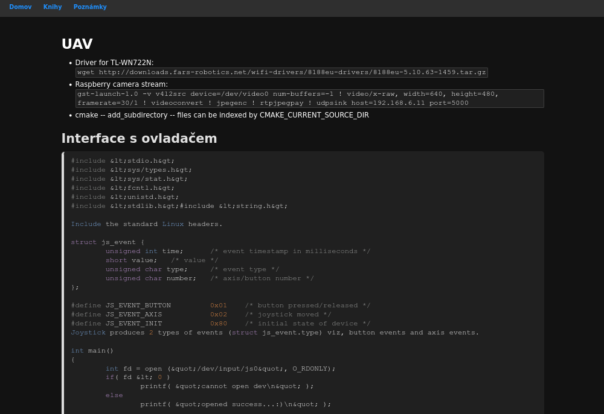

[#](#) CSS/JS/html for vimwiki
* dark theme by default
* syntax highlighting via google prettify
* straightforward css, actually editable by end user
* mobile friendly
	* this includes tables which get reformated

Live version of might be available on [wiki.havrak.xyz](https://wiki.havrak.xyz).
If you wish to display the site, you need to accept the self signed certificate (or use http).


Basic setup in .vimrc (vimwiki is stored in ~/.vim/vimwiki):
```vim
let g:vimwiki_list = [{'path': '~/.vim/vimwiki/', 'path_html': '~/.vim/vimwiki/html', "auto_diary_index": 1,'template_path': '~/.vim/vimwiki/templates','template_default': 'def_template', 'template_ext': '.html'}]
let g:vimwiki_listsyms = '✗✓'
let g:vimwiki_conceallevel = 2
let g:vimwiki_valid_html_tags = 'b,i,s,u,sub,sup,kbd,br,hr,pre,script,div'

```

Easiest way to setup is via symlinks
```bash
git clone https://github.com/havrak/vimwiki---dark-and-responsive
mv https://github.com/havrak/vimwiki---dark-and-responsive .vim/vimwiki_template
ln -sf $HOME/.vim/vimwiki_template/templates/ $HOME/.vim/vimwiki/
ln -sf $HOME/.vim/vimwiki_template/html/ $HOME/.vim/vimwiki/html/
```

Dynamic tables, aren't default behaviour. To use them table must be wrapperd in div with class dynamic-table.

```markdown
<div class="dynamic-table">
| Col1  | Col2  |
|-------|-------|
| item1 | item1 |
| item2 | item2 |
</div>
```

Code snippets use standart annotation:
```markdown
<pre class ="prettyprint lang-cpp">
{{{cpp
	#include <iostream>

	int main(void){
		return 0;
	}
}}}
</pre>
```

Same goes for math mode. MathJax isn't stored locally, if you wish to do so please edit def_template.html

```markdown
{{$
	\frac{5}{a}+\Delta_b = 5
}}$
```

## Screenshots



